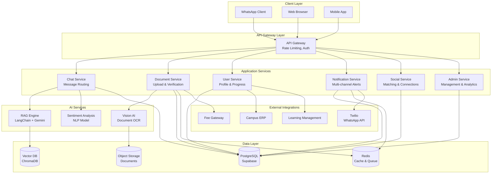

# Design Document: P.A.L. (Personal Assistant for Life on Campus)

## Overview

P.A.L. is an AI-powered onboarding platform built on a microservices architecture with an API-first design. The system integrates multiple AI capabilities including conversational AI (RAG-based chatbot), computer vision (document verification), and sentiment analysis to create a comprehensive onboarding experience.

The architecture follows a three-tier model:
1. **Presentation Layer**: Multi-channel interfaces (WhatsApp, Web, Mobile)
2. **Application Layer**: Core business logic, AI orchestration, and workflow management
3. **Data Layer**: Vector database (RAG), relational database (user state), and document storage

Key design principles:
- **API-First**: All functionality exposed through REST APIs for easy integration
- **Event-Driven**: Asynchronous processing for document verification and notifications
- **Modular AI**: Separate AI services for different capabilities (RAG, Vision, Sentiment)
- **Progressive Enhancement**: Core functionality works without AI, enhanced by AI capabilities

## Architecture

### System Architecture Diagram



### Technology Stack

**Frontend**:
- **Web**: Next.js 14 with TypeScript (React framework with SSR)
- **Mobile**: Flutter (cross-platform iOS/Android)
- **Admin Dashboard**: Streamlit (rapid prototyping) or React Admin

**Backend Services**:
- **Runtime**: Node.js with Express.js for API services
- **Language**: TypeScript for type safety
- **API Gateway**: Kong or AWS API Gateway

**AI/ML Stack**:
- **LLM**: Google Gemini 1.5 Pro (128k context window for RAG)
- **AI Framework**: LangChain for orchestration
- **Vision AI**: Google Cloud Vision API or Gemini Vision
- **Speech**: OpenAI Whisper for voice transcription
- **Sentiment**: Hugging Face Transformers (multilingual BERT)

**Data Storage**:
- **Vector Database**: ChromaDB (embedded) or Pinecone (cloud)
- **Relational Database**: PostgreSQL via Supabase
- **Object Storage**: AWS S3 or Supabase Storage
- **Cache/Queue**: Redis for session management and job queues

**Integrations**:
- **WhatsApp**: Twilio WhatsApp Business API
- **Notifications**: Twilio (SMS/WhatsApp), SendGrid (Email)
- **Authentication**: Supabase Auth with OTP

**DevOps**:
- **Hosting**: Vercel (frontend), Railway or Render (backend)
- **CI/CD**: GitHub Actions
- **Monitoring**: Sentry (errors), PostHog (analytics)

## Components and Interfaces

### 1. Chat Service

**Responsibility**: Handle all conversational interactions, route messages to appropriate AI services, maintain conversation context.

**Key Interfaces**:

```typescript
interface ChatService {
  // Send a message and get AI response
  sendMessage(request: ChatRequest): Promise<ChatResponse>
  
  // Get conversation history
  getHistory(userId: string, limit: number): Promise<Message[]>
  
  // Handle voice message
  processVoiceMessage(audioFile: Buffer, userId: string): Promise<ChatResponse>
}

interface ChatRequest {
  userId: string
  message: string
  channel: 'whatsapp' | 'web' | 'mobile'
  language?: 'en' | 'hi'
  context?: ConversationContext
}

interface ChatResponse {
  messageId: string
  response: string
  suggestedActions?: Action[]
  requiresHumanEscalation: boolean
  confidence: number
}

interface ConversationContext {
  currentPhase: Phase
  branch: string
  pendingTasks: string[]
  recentTopics: string[]
}
```

**Implementation Details**:
- Maintains conversation context in Redis with 24-hour TTL
- Routes queries to RAG engine with user-specific context
- Implements fallback to human escalation when confidence < 0.7
- Supports streaming responses for real-time chat experience

### 2. RAG Engine

**Responsibility**: Retrieve relevant information from knowledge base and generate contextual responses using LLM.

**Key Interfaces**:

```typescript
interface RAGEngine {
  // Query the knowledge base with context
  query(question: string, context: RAGContext): Promise<RAGResponse>
  
  // Index new documents into vector database
  indexDocument(document: Document): Promise<IndexResult>
  
  // Update existing document
  updateDocument(documentId: string, content: string): Promise<void>
}

interface RAGContext {
  userId: string
  branch: string
  currentPhase: Phase
  conversationHistory: Message[]
}

interface RAGResponse {
  answer: string
  sources: DocumentReference[]
  confidence: number
  suggestedFollowUps: string[]
}

interface Document {
  id: string
  title: string
  content: string
  metadata: {
    type: 'handbook' | 'circular' | 'faq'
    branch?: string
    phase?: Phase
    uploadDate: Date
    version: number
  }
}
```

**Implementation Details**:
- Uses tiered context retrieval: user-specific → branch-specific → general
- Implements semantic chunking (512 tokens per chunk with 50 token overlap)
- Embeddings: text-embedding-004 (768 dimensions)
- Retrieval: Top-5 chunks with MMR (Maximal Marginal Relevance) for diversity
- Prompt template includes system role, context chunks, conversation history, and user query
- Implements citation tracking to reference source documents

### 3. Document Service

**Responsibility**: Handle document uploads, orchestrate AI verification, manage verification workflow.

**Key Interfaces**:

```typescript
interface DocumentService {
  // Upload and verify document
  uploadDocument(request: UploadRequest): Promise<UploadResponse>
  
  // Get verification status
  getVerificationStatus(documentId: string): Promise<VerificationStatus>
  
  // Admin review action
  reviewDocument(documentId: string, action: ReviewAction): Promise<void>
  
  // Retry failed verification
  retryVerification(documentId: string): Promise<VerificationStatus>
}

interface UploadRequest {
  userId: string
  documentType: DocumentType
  file: Buffer
  fileName: string
  mimeType: string
}

interface UploadResponse {
  documentId: string
  status: 'processing' | 'verified' | 'flagged' | 'rejected'
  extractedData?: ExtractedData
  issues?: ValidationIssue[]
}

interface VerificationStatus {
  documentId: string
  status: TrafficLightStatus
  extractedData: ExtractedData
  validationResults: ValidationResult[]
  confidence: number
  reviewedBy?: string
  reviewedAt?: Date
}

type TrafficLightStatus = 'green' | 'yellow' | 'red'

type DocumentType = 
  | 'marksheet_10th'
  | 'marksheet_12th'
  | 'id_proof'
  | 'photo'
  | 'fee_receipt'
  | 'medical_certificate'
```

**Implementation Details**:
- Async processing using Redis queue (Bull)
- Vision AI extracts text and structured data (name, roll number, marks, dates)
- Validation rules compare extracted data against admission records
- Auto-approval threshold: 95% confidence + all fields match
- Yellow flag threshold: 70-95% confidence OR minor discrepancies
- Red flag: <70% confidence OR major discrepancies OR quality issues
- Stores original and processed images in S3 with 7-year retention

### 4. Vision AI Service

**Responsibility**: Extract structured data from document images using OCR and computer vision.

**Key Interfaces**:

```typescript
interface VisionAIService {
  // Extract data from document image
  extractData(image: Buffer, documentType: DocumentType): Promise<ExtractionResult>
  
  // Detect document quality issues
  assessQuality(image: Buffer): Promise<QualityAssessment>
  
  // Detect potential fraud indicators
  detectFraud(image: Buffer, documentType: DocumentType): Promise<FraudAssessment>
}

interface ExtractionResult {
  success: boolean
  confidence: number
  extractedFields: Record<string, FieldExtraction>
  rawText: string
}

interface FieldExtraction {
  value: string
  confidence: number
  boundingBox: BoundingBox
}

interface QualityAssessment {
  isAcceptable: boolean
  issues: QualityIssue[]
  overallScore: number
}

type QualityIssue = 
  | 'blurry'
  | 'low_resolution'
  | 'poor_lighting'
  | 'partial_document'
  | 'skewed'
  | 'glare'

interface FraudAssessment {
  riskLevel: 'low' | 'medium' | 'high'
  indicators: FraudIndicator[]
}

type FraudIndicator =
  | 'digital_manipulation'
  | 'inconsistent_fonts'
  | 'suspicious_patterns'
  | 'template_mismatch'
```

**Implementation Details**:
- Pre-processing: Auto-rotation, perspective correction, contrast enhancement
- OCR: Google Cloud Vision API with custom document type hints
- Field extraction: Template matching + regex patterns for each document type
- Quality checks: Laplacian variance for blur, resolution checks, brightness analysis
- Fraud detection: Metadata analysis, ELA (Error Level Analysis), font consistency
- Fallback: If primary extraction fails, attempt with alternative preprocessing

### 5. User Service

**Responsibility**: Manage user profiles, onboarding progress, phase transitions, and authentication.

**Key Interfaces**:

```typescript
interface UserService {
  // Get user profile and progress
  getProfile(userId: string): Promise<UserProfile>
  
  // Update onboarding progress
  updateProgress(userId: string, taskId: string, status: TaskStatus): Promise<void>
  
  // Get current phase and tasks
  getCurrentPhase(userId: string): Promise<PhaseInfo>
  
  // Transition to next phase
  advancePhase(userId: string): Promise<PhaseTransitionResult>
  
  // Authenticate user
  authenticate(admissionNumber: string, otp: string): Promise<AuthResult>
}

interface UserProfile {
  userId: string
  admissionNumber: string
  name: string
  email: string
  phone: string
  branch: string
  hostelBlock?: string
  currentPhase: Phase
  overallProgress: number
  joinedAt: Date
  preferences: UserPreferences
}

interface PhaseInfo {
  phase: Phase
  tasks: Task[]
  completionPercentage: number
  nextPhaseUnlocksAt?: Date
}

interface Task {
  taskId: string
  title: string
  description: string
  status: TaskStatus
  deadline?: Date
  dependencies: string[]
  requiredDocuments?: DocumentType[]
}

type TaskStatus = 'not_started' | 'in_progress' | 'completed' | 'overdue'

type Phase = 'documents' | 'fees' | 'hostel' | 'academics'

interface PhaseTransitionResult {
  success: boolean
  newPhase: Phase
  unlockedTasks: Task[]
  celebrationMessage: string
}
```

**Implementation Details**:
- Progress calculation: Weighted by task importance (critical tasks = 2x weight)
- Phase transition: Automatic when all critical tasks complete + manual admin override
- Task dependencies: DAG (Directed Acyclic Graph) validation
- Caching: User profile cached in Redis for 5 minutes
- Audit trail: All progress updates logged with timestamp

### 6. Notification Service

**Responsibility**: Send multi-channel notifications, manage notification preferences, handle bulk messaging.

**Key Interfaces**:

```typescript
interface NotificationService {
  // Send single notification
  sendNotification(notification: Notification): Promise<SendResult>
  
  // Send bulk notifications
  sendBulk(notifications: Notification[]): Promise<BulkSendResult>
  
  // Schedule notification
  scheduleNotification(notification: Notification, sendAt: Date): Promise<string>
  
  // Get notification history
  getHistory(userId: string): Promise<NotificationHistory[]>
  
  // Update preferences
  updatePreferences(userId: string, preferences: NotificationPreferences): Promise<void>
}

interface Notification {
  userId: string
  channel: NotificationChannel[]
  priority: 'low' | 'medium' | 'high' | 'urgent'
  template: string
  variables: Record<string, string>
  category: NotificationCategory
}

type NotificationChannel = 'whatsapp' | 'sms' | 'email' | 'push' | 'in_app'

type NotificationCategory = 
  | 'deadline_reminder'
  | 'phase_completion'
  | 'document_status'
  | 'social_match'
  | 'admin_announcement'
  | 'mentor_message'

interface NotificationPreferences {
  enabledChannels: NotificationChannel[]
  quietHours: { start: string; end: string }
  categoryPreferences: Record<NotificationCategory, boolean>
}
```

**Implementation Details**:
- Queue-based delivery using Bull with priority queues
- Rate limiting: Max 5 notifications per user per hour (except urgent)
- Template engine: Handlebars for dynamic content
- Delivery tracking: Status updates (sent, delivered, read, failed)
- Retry logic: 3 attempts with exponential backoff
- Quiet hours: Notifications queued and sent after quiet period ends
- Bulk optimization: Batch API calls to Twilio (up to 100 messages per request)

### 7. Social Service (Tribe Matcher)

**Responsibility**: Match students based on interests, manage connections, facilitate introductions.

**Key Interfaces**:

```typescript
interface SocialService {
  // Submit interests
  submitInterests(userId: string, interests: Interest[]): Promise<void>
  
  // Find matches
  findMatches(userId: string): Promise<Match[]>
  
  // Accept/decline match
  respondToMatch(userId: string, matchId: string, response: MatchResponse): Promise<void>
  
  // Get connections
  getConnections(userId: string): Promise<Connection[]>
}

interface Interest {
  category: InterestCategory
  tags: string[]
  proficiencyLevel?: 'beginner' | 'intermediate' | 'advanced'
}

type InterestCategory = 
  | 'sports'
  | 'music'
  | 'coding'
  | 'gaming'
  | 'arts'
  | 'reading'
  | 'volunteering'

interface Match {
  matchId: string
  otherUser: PublicProfile
  commonInterests: Interest[]
  matchScore: number
  proximityScore: number
  suggestedIcebreaker: string
}

interface PublicProfile {
  userId: string
  firstName: string
  branch: string
  hostelBlock?: string
  interests: Interest[]
  profilePicture?: string
}

type MatchResponse = 'accept' | 'decline' | 'maybe_later'

interface Connection {
  userId: string
  profile: PublicProfile
  connectedAt: Date
  commonInterests: Interest[]
}
```

**Implementation Details**:
- Matching algorithm: Weighted scoring (40% interest overlap + 30% proximity + 30% engagement)
- Interest overlap: Jaccard similarity on interest tags
- Proximity: Same hostel block = 1.0, same batch = 0.7, same branch = 0.5
- Privacy: Requires mutual consent before sharing contact info
- Batch processing: Matches computed nightly for all opted-in users
- Icebreaker generation: LLM generates personalized conversation starters based on common interests

### 8. Sentiment Analysis Service

**Responsibility**: Analyze student messages for distress signals, track sentiment trends, alert mentors.

**Key Interfaces**:

```typescript
interface SentimentService {
  // Analyze message sentiment
  analyzeSentiment(message: string, userId: string): Promise<SentimentResult>
  
  // Get sentiment trend
  getSentimentTrend(userId: string, days: number): Promise<SentimentTrend>
  
  // Get flagged students for mentor
  getFlaggedStudents(mentorId: string): Promise<FlaggedStudent[]>
  
  // Acknowledge alert
  acknowledgeAlert(alertId: string, mentorId: string): Promise<void>
}

interface SentimentResult {
  overallSentiment: 'positive' | 'neutral' | 'negative'
  sentimentScore: number // -1 to 1
  emotions: EmotionScore[]
  distressIndicators: DistressIndicator[]
  severityLevel: 'none' | 'low' | 'medium' | 'high' | 'critical'
}

interface EmotionScore {
  emotion: 'joy' | 'sadness' | 'anger' | 'fear' | 'confusion' | 'frustration'
  score: number // 0 to 1
}

interface DistressIndicator {
  type: 'anxiety' | 'depression' | 'overwhelm' | 'isolation' | 'academic_stress'
  confidence: number
  keywords: string[]
}

interface SentimentTrend {
  userId: string
  dataPoints: SentimentDataPoint[]
  overallTrend: 'improving' | 'stable' | 'declining'
  alertTriggered: boolean
}

interface SentimentDataPoint {
  date: Date
  averageSentiment: number
  messageCount: number
}

interface FlaggedStudent {
  userId: string
  profile: UserProfile
  alertId: string
  severityLevel: 'high' | 'critical'
  triggeredAt: Date
  recentSentiment: SentimentResult
  generalContext: string // No full transcripts
  acknowledged: boolean
}
```

**Implementation Details**:
- Model: Multilingual BERT fine-tuned on mental health datasets
- Privacy-preserving: Only stores sentiment scores, not message content
- Aggregation: Rolling 7-day sentiment average
- Alert thresholds: High = 3 consecutive negative days, Critical = severe distress keywords
- Context generation: LLM summarizes general topics without revealing specifics
- Mentor notification: Silent push notification + dashboard flag
- False positive mitigation: Requires sustained negative sentiment, not single messages

### 9. Admin Service

**Responsibility**: Provide admin interfaces for verification queue, analytics, knowledge base management, and bulk operations.

**Key Interfaces**:

```typescript
interface AdminService {
  // Get verification queue
  getVerificationQueue(filters: QueueFilters): Promise<VerificationQueueItem[]>
  
  // Get analytics dashboard data
  getAnalytics(timeRange: TimeRange): Promise<AnalyticsDashboard>
  
  // Upload knowledge base document
  uploadKnowledgeDocument(document: KnowledgeDocument): Promise<UploadResult>
  
  // Perform bulk operation
  performBulkOperation(operation: BulkOperation): Promise<BulkOperationResult>
  
  // Configure phases and tasks
  configurePhase(phaseConfig: PhaseConfiguration): Promise<void>
}

interface QueueFilters {
  status?: TrafficLightStatus[]
  documentType?: DocumentType[]
  branch?: string[]
  sortBy: 'priority' | 'uploadDate' | 'confidence'
}

interface VerificationQueueItem {
  documentId: string
  userId: string
  studentName: string
  documentType: DocumentType
  status: TrafficLightStatus
  uploadedAt: Date
  extractedData: ExtractedData
  validationIssues: ValidationIssue[]
  confidence: number
  priority: number
}

interface AnalyticsDashboard {
  overview: {
    totalStudents: number
    byPhase: Record<Phase, number>
    overallCompletion: number
  }
  funnel: FunnelData[]
  bottlenecks: Bottleneck[]
  topQueries: QueryAnalytics[]
  verificationMetrics: VerificationMetrics
  timeSeriesData: TimeSeriesPoint[]
}

interface FunnelData {
  phase: Phase
  entered: number
  completed: number
  averageTimeToComplete: number
  dropoffRate: number
}

interface Bottleneck {
  phase: Phase
  task: string
  studentsAffected: number
  averageStuckTime: number
  suggestedAction: string
}

interface BulkOperation {
  type: 'send_notification' | 'reset_phase' | 'export_data'
  targetUsers: string[]
  parameters: Record<string, any>
}
```

**Implementation Details**:
- Queue optimization: Priority scoring (red > yellow > green, older > newer)
- Analytics caching: Dashboard data cached for 15 minutes
- Real-time updates: WebSocket connection for live queue updates
- Bulk operations: Async processing with progress tracking
- Knowledge base: Automatic PDF parsing, chunking, and vectorization
- Audit logging: All admin actions logged with user ID and timestamp

## Data Models

### Core Entities

**User**:
```typescript
interface User {
  id: string // UUID
  admissionNumber: string // Unique
  email: string
  phone: string
  name: string
  branch: string
  batch: number
  hostelBlock?: string
  roomNumber?: string
  currentPhase: Phase
  overallProgress: number
  enrollmentDate: Date
  createdAt: Date
  updatedAt: Date
  
  // Relations
  documents: Document[]
  tasks: UserTask[]
  interests: Interest[]
  connections: Connection[]
  mentor?: Mentor
}
```

**Document**:
```typescript
interface Document {
  id: string // UUID
  userId: string
  documentType: DocumentType
  status: TrafficLightStatus
  originalFileUrl: string
  processedFileUrl?: string
  uploadedAt: Date
  verifiedAt?: Date
  verifiedBy?: string // Admin ID
  
  extractedData: ExtractedData
  validationResults: ValidationResult[]
  confidence: number
  reviewNotes?: string
  
  // Audit
  createdAt: Date
  updatedAt: Date
}

interface ExtractedData {
  fields: Record<string, any>
  rawText: string
  metadata: {
    pageCount?: number
    fileSize: number
    dimensions?: { width: number; height: number }
  }
}

interface ValidationResult {
  field: string
  expected: string
  extracted: string
  match: boolean
  confidence: number
  issue?: string
}
```

**Task**:
```typescript
interface TaskDefinition {
  id: string // UUID
  phase: Phase
  title: string
  description: string
  order: number
  isCritical: boolean
  weight: number
  dependencies: string[] // Task IDs
  requiredDocuments: DocumentType[]
  estimatedDuration: number // minutes
  instructions: string
  helpResources: Resource[]
  
  // Conditional logic
  applicableFor?: {
    branches?: string[]
    hostelResident?: boolean
    customCondition?: string
  }
}

interface UserTask {
  id: string // UUID
  userId: string
  taskDefinitionId: string
  status: TaskStatus
  startedAt?: Date
  completedAt?: Date
  deadline?: Date
  
  // Progress tracking
  attempts: number
  lastActivityAt: Date
  notes?: string
}
```

**Conversation**:
```typescript
interface Conversation {
  id: string // UUID
  userId: string
  channel: NotificationChannel
  startedAt: Date
  lastMessageAt: Date
  
  messages: Message[]
  context: ConversationContext
}

interface Message {
  id: string // UUID
  conversationId: string
  role: 'user' | 'assistant' | 'system'
  content: string
  timestamp: Date
  
  // Metadata
  channel: NotificationChannel
  language: 'en' | 'hi'
  sentimentScore?: number
  confidence?: number
  sources?: DocumentReference[]
}
```

**Match**:
```typescript
interface Match {
  id: string // UUID
  user1Id: string
  user2Id: string
  matchScore: number
  commonInterests: Interest[]
  status: 'pending' | 'accepted' | 'declined' | 'connected'
  createdAt: Date
  
  // Responses
  user1Response?: MatchResponse
  user2Response?: MatchResponse
  user1RespondedAt?: Date
  user2RespondedAt?: Date
}
```

**Alert**:
```typescript
interface Alert {
  id: string // UUID
  userId: string
  mentorId: string
  type: 'sentiment' | 'inactivity' | 'deadline' | 'custom'
  severityLevel: 'low' | 'medium' | 'high' | 'critical'
  triggeredAt: Date
  acknowledgedAt?: Date
  acknowledgedBy?: string
  
  context: {
    summary: string
    sentimentTrend?: SentimentTrend
    relatedTasks?: string[]
    suggestedAction?: string
  }
  
  resolved: boolean
  resolvedAt?: Date
  resolution?: string
}
```

### Database Schema

**PostgreSQL Tables**:

```sql
-- Users table
CREATE TABLE users (
  id UUID PRIMARY KEY DEFAULT gen_random_uuid(),
  admission_number VARCHAR(50) UNIQUE NOT NULL,
  email VARCHAR(255) UNIQUE NOT NULL,
  phone VARCHAR(20) NOT NULL,
  name VARCHAR(255) NOT NULL,
  branch VARCHAR(100) NOT NULL,
  batch INTEGER NOT NULL,
  hostel_block VARCHAR(50),
  room_number VARCHAR(20),
  current_phase VARCHAR(50) NOT NULL,
  overall_progress DECIMAL(5,2) DEFAULT 0,
  enrollment_date DATE NOT NULL,
  created_at TIMESTAMP DEFAULT NOW(),
  updated_at TIMESTAMP DEFAULT NOW()
);

CREATE INDEX idx_users_admission ON users(admission_number);
CREATE INDEX idx_users_phase ON users(current_phase);
CREATE INDEX idx_users_branch ON users(branch);

-- Documents table
CREATE TABLE documents (
  id UUID PRIMARY KEY DEFAULT gen_random_uuid(),
  user_id UUID REFERENCES users(id) ON DELETE CASCADE,
  document_type VARCHAR(50) NOT NULL,
  status VARCHAR(20) NOT NULL,
  original_file_url TEXT NOT NULL,
  processed_file_url TEXT,
  uploaded_at TIMESTAMP DEFAULT NOW(),
  verified_at TIMESTAMP,
  verified_by UUID,
  extracted_data JSONB,
  validation_results JSONB,
  confidence DECIMAL(5,4),
  review_notes TEXT,
  created_at TIMESTAMP DEFAULT NOW(),
  updated_at TIMESTAMP DEFAULT NOW()
);

CREATE INDEX idx_documents_user ON documents(user_id);
CREATE INDEX idx_documents_status ON documents(status);
CREATE INDEX idx_documents_type ON documents(document_type);

-- Task definitions table
CREATE TABLE task_definitions (
  id UUID PRIMARY KEY DEFAULT gen_random_uuid(),
  phase VARCHAR(50) NOT NULL,
  title VARCHAR(255) NOT NULL,
  description TEXT,
  order_index INTEGER NOT NULL,
  is_critical BOOLEAN DEFAULT false,
  weight DECIMAL(3,2) DEFAULT 1.0,
  dependencies JSONB DEFAULT '[]',
  required_documents JSONB DEFAULT '[]',
  estimated_duration INTEGER,
  instructions TEXT,
  help_resources JSONB,
  applicable_for JSONB,
  created_at TIMESTAMP DEFAULT NOW(),
  updated_at TIMESTAMP DEFAULT NOW()
);

CREATE INDEX idx_task_definitions_phase ON task_definitions(phase);

-- User tasks table
CREATE TABLE user_tasks (
  id UUID PRIMARY KEY DEFAULT gen_random_uuid(),
  user_id UUID REFERENCES users(id) ON DELETE CASCADE,
  task_definition_id UUID REFERENCES task_definitions(id),
  status VARCHAR(50) NOT NULL,
  started_at TIMESTAMP,
  completed_at TIMESTAMP,
  deadline TIMESTAMP,
  attempts INTEGER DEFAULT 0,
  last_activity_at TIMESTAMP,
  notes TEXT,
  created_at TIMESTAMP DEFAULT NOW(),
  updated_at TIMESTAMP DEFAULT NOW()
);

CREATE INDEX idx_user_tasks_user ON user_tasks(user_id);
CREATE INDEX idx_user_tasks_status ON user_tasks(status);
CREATE INDEX idx_user_tasks_deadline ON user_tasks(deadline);

-- Conversations table
CREATE TABLE conversations (
  id UUID PRIMARY KEY DEFAULT gen_random_uuid(),
  user_id UUID REFERENCES users(id) ON DELETE CASCADE,
  channel VARCHAR(50) NOT NULL,
  started_at TIMESTAMP DEFAULT NOW(),
  last_message_at TIMESTAMP DEFAULT NOW(),
  context JSONB
);

CREATE INDEX idx_conversations_user ON conversations(user_id);

-- Messages table
CREATE TABLE messages (
  id UUID PRIMARY KEY DEFAULT gen_random_uuid(),
  conversation_id UUID REFERENCES conversations(id) ON DELETE CASCADE,
  role VARCHAR(20) NOT NULL,
  content TEXT NOT NULL,
  timestamp TIMESTAMP DEFAULT NOW(),
  channel VARCHAR(50),
  language VARCHAR(10),
  sentiment_score DECIMAL(3,2),
  confidence DECIMAL(5,4),
  sources JSONB
);

CREATE INDEX idx_messages_conversation ON messages(conversation_id);
CREATE INDEX idx_messages_timestamp ON messages(timestamp);

-- Interests table
CREATE TABLE interests (
  id UUID PRIMARY KEY DEFAULT gen_random_uuid(),
  user_id UUID REFERENCES users(id) ON DELETE CASCADE,
  category VARCHAR(50) NOT NULL,
  tags JSONB NOT NULL,
  proficiency_level VARCHAR(20),
  created_at TIMESTAMP DEFAULT NOW()
);

CREATE INDEX idx_interests_user ON interests(user_id);
CREATE INDEX idx_interests_category ON interests(category);

-- Matches table
CREATE TABLE matches (
  id UUID PRIMARY KEY DEFAULT gen_random_uuid(),
  user1_id UUID REFERENCES users(id) ON DELETE CASCADE,
  user2_id UUID REFERENCES users(id) ON DELETE CASCADE,
  match_score DECIMAL(5,4) NOT NULL,
  common_interests JSONB,
  status VARCHAR(50) NOT NULL,
  user1_response VARCHAR(20),
  user2_response VARCHAR(20),
  user1_responded_at TIMESTAMP,
  user2_responded_at TIMESTAMP,
  created_at TIMESTAMP DEFAULT NOW()
);

CREATE INDEX idx_matches_user1 ON matches(user1_id);
CREATE INDEX idx_matches_user2 ON matches(user2_id);
CREATE INDEX idx_matches_status ON matches(status);

-- Alerts table
CREATE TABLE alerts (
  id UUID PRIMARY KEY DEFAULT gen_random_uuid(),
  user_id UUID REFERENCES users(id) ON DELETE CASCADE,
  mentor_id UUID REFERENCES users(id),
  type VARCHAR(50) NOT NULL,
  severity_level VARCHAR(20) NOT NULL,
  triggered_at TIMESTAMP DEFAULT NOW(),
  acknowledged_at TIMESTAMP,
  acknowledged_by UUID,
  context JSONB,
  resolved BOOLEAN DEFAULT false,
  resolved_at TIMESTAMP,
  resolution TEXT
);

CREATE INDEX idx_alerts_user ON alerts(user_id);
CREATE INDEX idx_alerts_mentor ON alerts(mentor_id);
CREATE INDEX idx_alerts_severity ON alerts(severity_level);
CREATE INDEX idx_alerts_resolved ON alerts(resolved);

-- Notifications table
CREATE TABLE notifications (
  id UUID PRIMARY KEY DEFAULT gen_random_uuid(),
  user_id UUID REFERENCES users(id) ON DELETE CASCADE,
  channel VARCHAR(50) NOT NULL,
  priority VARCHAR(20) NOT NULL,
  category VARCHAR(50) NOT NULL,
  template VARCHAR(100) NOT NULL,
  variables JSONB,
  status VARCHAR(20) NOT NULL,
  sent_at TIMESTAMP,
  delivered_at TIMESTAMP,
  read_at TIMESTAMP,
  failed_reason TEXT,
  created_at TIMESTAMP DEFAULT NOW()
);

CREATE INDEX idx_notifications_user ON notifications(user_id);
CREATE INDEX idx_notifications_status ON notifications(status);
CREATE INDEX idx_notifications_sent ON notifications(sent_at);
```

**Vector Database (ChromaDB) Collections**:

```python
# Knowledge base collection
knowledge_base = {
  "name": "pal_knowledge_base",
  "metadata": {
    "description": "College handbooks, circulars, and FAQs"
  },
  "embedding_function": "text-embedding-004",
  "documents": [
    {
      "id": "doc_uuid",
      "content": "chunk_text",
      "metadata": {
        "document_id": "original_doc_id",
        "title": "document_title",
        "type": "handbook|circular|faq",
        "branch": "optional_branch",
        "phase": "optional_phase",
        "upload_date": "iso_date",
        "version": 1,
        "chunk_index": 0,
        "total_chunks": 10
      }
    }
  ]
}
```

## Correctness Properties

*A property is a characteristic or behavior that should hold true across all valid executions of a system—essentially, a formal statement about what the system should do. Properties serve as the bridge between human-readable specifications and machine-verifiable correctness guarantees.*

Before writing the correctness properties, I need to analyze the acceptance criteria from the requirements document to determine which are testable as properties.


### Property Reflection

After analyzing all acceptance criteria, I've identified several areas where properties can be consolidated:

**Redundancy Analysis**:
1. Properties about "displaying" information (3.1, 3.2, 8.2, 10.1, 11.1, 11.2) can be consolidated into properties about data completeness rather than UI rendering
2. Properties about notification sending (4.1, 4.2, 4.3, 4.4) share the same underlying mechanism and can be unified into a property about notification triggering based on events
3. Properties about status updates (2.6, 8.3) are redundant - they both verify that actions trigger state changes
4. Properties about privacy (12.1, 12.5) can be combined into a single privacy enforcement property
5. Properties about access control (14.3) and audit logging (14.4) are complementary but distinct
6. Properties about document format support (2.7) and API availability (16.1) are better tested as examples rather than properties

**Consolidated Properties**:
- Combine response time properties into performance property
- Combine traffic light status properties (2.3, 2.4, 2.5) into document classification property
- Combine match criteria properties (5.2, 5.6) into matching algorithm property
- Combine knowledge base properties (9.2, 9.5) into searchability property

### Core Correctness Properties

**Property 1: Context-Aware RAG Retrieval**
*For any* student query and student context (branch, phase), all retrieved documents from the RAG system should match the student's branch or be branch-agnostic, and should be relevant to their current phase or earlier phases.
**Validates: Requirements 1.2**

**Property 2: Language Consistency**
*For any* message sent in a specific language (Hindi or English), the response language should match the input language.
**Validates: Requirements 1.3**

**Property 3: Low Confidence Escalation**
*For any* query where the RAG system confidence score is below 0.7, the response should include an acknowledgment of uncertainty and an offer to connect with a human administrator.
**Validates: Requirements 1.4**

**Property 4: Document Extraction Completeness**
*For any* uploaded document of a known type, the Smart_Scan should attempt extraction and return either extracted data or a quality assessment explaining why extraction failed.
**Validates: Requirements 2.1**

**Property 5: Document Classification Correctness**
*For any* document with extracted data, the traffic light status should be: green if confidence ≥ 0.95 AND all fields match admission records, yellow if 0.70 ≤ confidence < 0.95 OR minor discrepancies exist, red if confidence < 0.70 OR major discrepancies OR quality issues detected.
**Validates: Requirements 2.3, 2.4, 2.5**

**Property 6: Progress Update Atomicity**
*For any* document verification completion (any status), the student's onboarding progress should be updated in the same transaction, ensuring progress reflects the verification result.
**Validates: Requirements 2.6**

**Property 7: Dashboard Data Completeness**
*For any* student accessing their dashboard, the displayed data should include their current phase, overall completion percentage, all tasks for the current phase with status indicators, and any deadlines.
**Validates: Requirements 3.1, 3.2, 3.3, 3.5**

**Property 8: Phase Transition Automation**
*For any* student who completes all critical tasks in a phase, the system should automatically advance them to the next phase and send a congratulatory notification within 1 minute.
**Validates: Requirements 3.4**

**Property 9: Deadline Highlighting**
*For any* task with a deadline within 48 hours, the dashboard should apply a visual highlight or urgent indicator to that task.
**Validates: Requirements 3.3**

**Property 10: Event-Based Notification Triggering**
*For any* triggering event (deadline within 48 hours, 3-day inactivity, new announcement, milestone completion), the system should create and queue a notification to the affected user(s) within the specified time window.
**Validates: Requirements 4.1, 4.2, 4.3, 4.4**

**Property 11: Quiet Hours Enforcement**
*For any* notification scheduled during a user's configured quiet hours, the notification should be queued and delivered after the quiet period ends, unless marked as urgent.
**Validates: Requirements 4.5**

**Property 12: Match Criteria Enforcement**
*For any* two students matched by the Tribe_Matcher, they should have at least 2 common interest tags AND (same hostel block OR same batch OR same branch), with same hostel block matches having higher priority scores.
**Validates: Requirements 5.2, 5.6**

**Property 13: Match Suggestion Content**
*For any* match suggestion presented to a user, the suggestion should include the other user's public profile and explicitly list the common interests.
**Validates: Requirements 5.3**

**Property 14: Consent-Based Contact Sharing**
*For any* two matched students, contact information should only be shared after both students have explicitly accepted the match.
**Validates: Requirements 5.4**

**Property 15: Decline Permanence**
*For any* match declined by a user, the system should never suggest that same pairing again (in either direction).
**Validates: Requirements 5.5**

**Property 16: Navigation Response Format**
*For any* request for directions to a campus location, the response should include step-by-step instructions, recognizable landmarks, and estimated walking time.
**Validates: Requirements 6.1, 6.2**

**Property 17: Proactive Navigation Timing**
*For any* student with an upcoming appointment or class, a navigation offer should be sent exactly 15 minutes before the scheduled time.
**Validates: Requirements 6.4**

**Property 18: Course-Career Mapping**
*For any* course viewed by a student, the system should display associated career paths, industries, real-world examples, and potential job roles.
**Validates: Requirements 7.1, 7.2**

**Property 19: Career-Based Recommendations**
*For any* student expressing interest in a specific career, the system should return a list of relevant courses and suggested electives that align with that career path.
**Validates: Requirements 7.4**

**Property 20: Verification Queue Sorting**
*For any* administrator accessing the verification queue, documents should be sorted with red status first, then yellow, then green, and within each status group, older documents should appear before newer ones.
**Validates: Requirements 8.1**

**Property 21: Yellow Flag Display Completeness**
*For any* yellow-flagged document viewed by an administrator, the display should include the extracted data, the original document image, and highlighted discrepancies between extracted and expected values.
**Validates: Requirements 8.2**

**Property 22: Rejection Reason Enforcement**
*For any* document rejection by an administrator, the system should require a non-empty reason field and automatically send a notification to the student containing that reason.
**Validates: Requirements 8.4**

**Property 23: Knowledge Base Update Timeliness**
*For any* PDF document uploaded to the knowledge base, text extraction, chunking, embedding generation, and vector database indexing should complete within 5 minutes, making the content searchable.
**Validates: Requirements 9.1**

**Property 24: Knowledge Base Searchability**
*For any* document successfully added to the knowledge base, a query containing key terms from that document should retrieve it in the top-5 results within 1 minute of indexing completion.
**Validates: Requirements 9.2**

**Property 25: Duplicate Detection**
*For any* document uploaded to the knowledge base, if a document with >80% content similarity already exists, the system should flag it as a potential duplicate.
**Validates: Requirements 9.3**

**Property 26: Version History Maintenance**
*For any* document in the knowledge base, the system should maintain a version history including upload timestamp, uploader ID, and version number, accessible through the admin interface.
**Validates: Requirements 9.4**

**Property 27: Obsolete Document Handling**
*For any* document marked as obsolete, it should not appear in RAG retrieval results but should remain accessible through the archive interface.
**Validates: Requirements 9.5**

**Property 28: Analytics Data Accuracy**
*For any* analytics dashboard view, the displayed student counts per phase should equal the sum of students in that phase in the database, and completion percentages should be calculated as (completed tasks / total tasks) * 100.
**Validates: Requirements 10.1**

**Property 29: Bottleneck Detection**
*For any* phase where the average time-to-complete exceeds 2x the expected duration OR drop-off rate exceeds 20%, the analytics dashboard should highlight it as a bottleneck.
**Validates: Requirements 10.2**

**Property 30: Bulk Nudge Functionality**
*For any* bulk nudge operation triggered by an administrator, a notification should be queued for every student matching the filter criteria (e.g., all students in a specific phase).
**Validates: Requirements 10.3**

**Property 31: FAQ Analytics**
*For any* analytics dashboard view, the top 10 most frequently asked questions should be calculated from the query log and displayed with their occurrence counts.
**Validates: Requirements 10.5**

**Property 32: Mentor Dashboard Completeness**
*For any* mentor accessing their dashboard, all students assigned to that mentor should be displayed with their current phase, completion status, last activity timestamp, and engagement level.
**Validates: Requirements 11.1, 11.2**

**Property 33: Sentiment-Based Flagging**
*For any* student whose sentiment analysis detects severe distress indicators (severity score ≥ 0.8), the student should be flagged on their assigned mentor's dashboard within 5 minutes.
**Validates: Requirements 11.3**

**Property 34: Flag Context Provision**
*For any* flagged student on the mentor dashboard, the flag should include context containing recent query topics (not full transcripts), sentiment analysis summary, and severity score.
**Validates: Requirements 11.4**

**Property 35: Inactivity Alert**
*For any* student with no activity for 5 consecutive days and pending tasks, an alert notification should be sent to their assigned mentor.
**Validates: Requirements 11.6**

**Property 36: Privacy-Preserving Sentiment Analysis**
*For any* message analyzed by the sentiment monitor, the system should store only the sentiment score, emotion scores, and distress indicators, never the full message content, and mentors should never have access to full conversation transcripts.
**Validates: Requirements 12.1, 12.5**

**Property 37: Severity Scoring**
*For any* message containing distress indicators (keywords like "anxious", "overwhelmed", "can't cope"), the system should assign a severity score between 0 and 1 based on the intensity and frequency of indicators.
**Validates: Requirements 12.2**

**Property 38: Critical Alert Triggering**
*For any* sentiment analysis result with severity score ≥ 0.8, the system should immediately create an alert and send a silent notification to the assigned mentor.
**Validates: Requirements 12.3**

**Property 39: Sentiment Trend Detection**
*For any* student with a 7-day rolling average sentiment score that drops by more than 0.3 points compared to their previous 7-day average, the system should flag a sudden negative change.
**Validates: Requirements 12.4**

**Property 40: Alert Acknowledgment Tracking**
*For any* alert acknowledged by a mentor, the system should update the alert status to "acknowledged", record the mentor ID, timestamp, and calculate response time from trigger to acknowledgment.
**Validates: Requirements 12.6**

**Property 41: Multi-Channel Consistency**
*For any* core functionality (send message, view dashboard, upload document, view progress), the functionality should be available and produce equivalent results across WhatsApp, web, and mobile channels.
**Validates: Requirements 13.1**

**Property 42: Cross-Channel Context Preservation**
*For any* student who sends a message on one channel and then switches to another channel, their conversation history and context should be accessible on the new channel.
**Validates: Requirements 13.2**

**Property 43: Voice Message Transcription**
*For any* voice message sent via WhatsApp, the system should transcribe it to text using speech recognition and process it as a text query.
**Validates: Requirements 13.3**

**Property 44: Multilingual Voice Support**
*For any* voice message in Hindi or English, the system should correctly detect the language and transcribe it with >85% accuracy.
**Validates: Requirements 13.4**

**Property 45: Document Encryption**
*For any* document uploaded by a student, the file should be encrypted using AES-256 before storage, and all transfers should use TLS 1.3.
**Validates: Requirements 14.2**

**Property 46: Role-Based Access Control**
*For any* API request to access user data, the system should verify that the requesting user has the appropriate role (student can only access own data, admin can access all data, mentor can access assigned students' data).
**Validates: Requirements 14.3**

**Property 47: Access Audit Logging**
*For any* access to student data by an administrator or mentor, the system should create an audit log entry containing accessor ID, student ID, timestamp, and access purpose.
**Validates: Requirements 14.4**

**Property 48: Data Retention Enforcement**
*For any* student whose graduation date plus 2 years has passed, the system should automatically purge their sensitive documents while retaining anonymized analytics data.
**Validates: Requirements 14.5**

**Property 49: Data Deletion Completeness**
*For any* student who requests account deletion, the system should remove all associated data including profile, documents, messages, tasks, and matches within 30 days.
**Validates: Requirements 14.6**

**Property 50: Response Time Performance**
*For any* user action under normal load conditions, the system should return a response within 3 seconds.
**Validates: Requirements 15.1**

**Property 51: Graceful Degradation**
*For any* scenario where the AI service is unavailable, the system should queue the request, return a graceful error message to the user, and process the request when the service recovers.
**Validates: Requirements 15.4**

**Property 52: Error Handling**
*For any* error encountered during request processing, the system should return a user-friendly error message (not stack traces) and log the full error details with request ID for debugging.
**Validates: Requirements 15.6**

**Property 53: Webhook Processing**
*For any* webhook received from an external system (fee gateway, ERP, LMS), the system should validate the signature, process the payload, update relevant student data, and return a 200 OK response within 5 seconds.
**Validates: Requirements 16.2**

**Property 54: ERP Sync Timeliness**
*For any* student data update in the ERP system, the P.A.L. system should detect and sync the changes within 15 minutes.
**Validates: Requirements 16.3**

**Property 55: API Retry Logic**
*For any* failed API call to an external system, the system should retry up to 3 times with exponential backoff (1s, 2s, 4s) before marking the operation as failed.
**Validates: Requirements 16.5**

**Property 56: Sync Audit Logging**
*For any* data synchronization event with external systems, the system should log the event type, timestamp, affected records, success/failure status, and any error messages.
**Validates: Requirements 16.6**

**Property 57: Task Dependency Enforcement**
*For any* task with prerequisite tasks, the system should prevent students from starting or completing it until all prerequisite tasks are marked as completed.
**Validates: Requirements 17.3**

**Property 58: Conditional Task Applicability**
*For any* task with conditional logic (e.g., only for hostel residents), the task should only appear in the task list for students matching the condition.
**Validates: Requirements 17.4**

**Property 59: Configuration Update Safety**
*For any* phase configuration update by an administrator, tasks already completed by students should remain marked as completed and not be reset.
**Validates: Requirements 17.5**

**Property 60: Bulk Operation Async Processing**
*For any* bulk operation affecting more than 10 students, the system should process it asynchronously, provide a progress indicator, and allow the administrator to continue other work.
**Validates: Requirements 18.2**

**Property 61: Bulk Operation Reporting**
*For any* completed bulk operation, the system should generate a summary report showing total records processed, successful operations, failed operations, and error details for failures.
**Validates: Requirements 18.3**

**Property 62: CSV Import Validation**
*For any* CSV file uploaded for student import, the system should validate each row against the schema, report all validation errors with row numbers, and only import valid rows.
**Validates: Requirements 18.5**

**Property 63: Compliance Report Generation**
*For any* compliance report request, the system should generate a PDF containing completion rates by phase and branch, verification audit trails, and institutional metadata within 30 seconds.
**Validates: Requirements 19.1, 19.3**

**Property 64: Scheduled Report Delivery**
*For any* scheduled report configured by an administrator, the system should generate and email the report at the specified time each week.
**Validates: Requirements 19.4**

**Property 65: Historical Snapshot Maintenance**
*For any* end-of-month date, the system should automatically create a snapshot of onboarding data (student counts, completion rates, phase distribution) for historical comparison.
**Validates: Requirements 19.5**

**Property 66: Gamification Point Award**
*For any* task completed by a student with gamification enabled, the system should award points based on task weight and update the leaderboard within 1 minute.
**Validates: Requirements 20.1**

**Property 67: Achievement Badge Unlocking**
*For any* student reaching a milestone (e.g., complete a phase, help 3 peers), the system should unlock the corresponding achievement badge and display it on their profile.
**Validates: Requirements 20.2**

**Property 68: Milestone Celebration**
*For any* key completion point (25%, 50%, 75%, 100% of a phase), the system should display an encouraging message to the student.
**Validates: Requirements 20.3**

**Property 69: Gamification Opt-Out**
*For any* student who disables gamification in preferences, the system should hide all gamification elements (points, leaderboard, badges) from their interface while still tracking progress normally.
**Validates: Requirements 20.5**

## Error Handling

### Error Categories and Strategies

**1. User Input Errors**
- Invalid document formats, corrupted files, malformed queries
- Strategy: Validate early, provide clear error messages with corrective actions
- Example: "The uploaded file appears to be corrupted. Please try taking a clearer photo of your document."

**2. AI Service Errors**
- LLM API failures, timeout, rate limiting, low confidence responses
- Strategy: Implement circuit breaker pattern, queue requests, graceful degradation
- Fallback: For RAG failures, return cached FAQ responses or escalate to human

**3. External Integration Errors**
- ERP/LMS/Fee gateway API failures, webhook delivery failures
- Strategy: Retry with exponential backoff, dead letter queue for persistent failures
- Monitoring: Alert admins when integration is down for >15 minutes

**4. Data Consistency Errors**
- Race conditions in phase transitions, duplicate document uploads
- Strategy: Use database transactions, optimistic locking, idempotency keys
- Example: Prevent double-submission of documents using client-generated upload IDs

**5. Performance Errors**
- Slow queries, memory exhaustion, queue backlog
- Strategy: Query optimization, caching, horizontal scaling, rate limiting
- Monitoring: Alert when response time >5s or queue depth >1000

### Error Response Format

All API errors follow a consistent format:

```typescript
interface ErrorResponse {
  error: {
    code: string // Machine-readable error code
    message: string // User-friendly message
    details?: any // Additional context for debugging
    requestId: string // For support tracking
    timestamp: string
  }
}
```

### Critical Error Scenarios

**Scenario 1: Document Verification Failure**
- Trigger: Vision AI service unavailable
- Response: Queue document for processing, notify student of delay
- Fallback: Manual admin review if AI unavailable for >1 hour

**Scenario 2: RAG System Failure**
- Trigger: Vector database unreachable
- Response: Serve cached responses for common queries
- Fallback: Display FAQ page and offer human escalation

**Scenario 3: Notification Delivery Failure**
- Trigger: Twilio API error or rate limit
- Response: Retry with exponential backoff (3 attempts)
- Fallback: Store in dead letter queue, send via alternative channel (email)

**Scenario 4: Phase Transition Race Condition**
- Trigger: Two tasks completed simultaneously
- Response: Use database transaction with row-level locking
- Validation: Verify phase transition only happens once

**Scenario 5: Data Sync Conflict**
- Trigger: Student data updated in both P.A.L. and ERP simultaneously
- Response: ERP is source of truth, P.A.L. data overwritten
- Logging: Log conflict for admin review

## Testing Strategy

### Dual Testing Approach

The P.A.L. system requires both unit tests and property-based tests for comprehensive coverage:

**Unit Tests**: Focus on specific examples, edge cases, and integration points
- Example: Test that a specific student profile renders correctly
- Example: Test that uploading a blurry image returns a specific error
- Example: Test that the first-time user flow shows the welcome message

**Property-Based Tests**: Verify universal properties across all inputs
- Example: For any student, their progress percentage should be between 0 and 100
- Example: For any document upload, the system should return a valid status
- Example: For any match, both users should have at least 2 common interests

Both approaches are complementary and necessary. Unit tests catch concrete bugs in specific scenarios, while property tests verify general correctness across the input space.

### Property-Based Testing Configuration

**Framework**: fast-check (for TypeScript/JavaScript services)

**Configuration**:
- Minimum 100 iterations per property test (due to randomization)
- Seed-based reproducibility for failed tests
- Shrinking enabled to find minimal failing examples

**Tagging Convention**:
Each property test must include a comment referencing the design document property:

```typescript
// Feature: pal-campus-assistant, Property 1: Context-Aware RAG Retrieval
test('RAG retrieval respects student context', async () => {
  await fc.assert(
    fc.asyncProperty(
      studentContextArbitrary(),
      queryArbitrary(),
      async (context, query) => {
        const results = await ragEngine.query(query, context);
        // Verify all results match context filters
        results.sources.forEach(source => {
          expect(
            source.metadata.branch === context.branch ||
            source.metadata.branch === undefined
          ).toBe(true);
        });
      }
    ),
    { numRuns: 100 }
  );
});
```

### Test Organization

**Unit Tests**:
```
tests/
  unit/
    services/
      chat.service.test.ts
      document.service.test.ts
      rag.engine.test.ts
      vision-ai.service.test.ts
      user.service.test.ts
      notification.service.test.ts
      social.service.test.ts
      sentiment.service.test.ts
      admin.service.test.ts
    api/
      chat.routes.test.ts
      document.routes.test.ts
      user.routes.test.ts
      admin.routes.test.ts
    utils/
      validation.test.ts
      encryption.test.ts
```

**Property Tests**:
```
tests/
  properties/
    rag-retrieval.property.test.ts
    document-classification.property.test.ts
    phase-transition.property.test.ts
    notification-triggering.property.test.ts
    matching-algorithm.property.test.ts
    sentiment-analysis.property.test.ts
    access-control.property.test.ts
    data-consistency.property.test.ts
```

**Integration Tests**:
```
tests/
  integration/
    onboarding-flow.test.ts
    document-verification-flow.test.ts
    social-matching-flow.test.ts
    admin-workflow.test.ts
    external-integrations.test.ts
```

### Test Data Strategy

**Generators for Property Tests**:
```typescript
// Arbitrary generators for property-based testing
const studentContextArbitrary = () => fc.record({
  userId: fc.uuid(),
  branch: fc.constantFrom('CSE', 'ECE', 'ME', 'CE'),
  currentPhase: fc.constantFrom('documents', 'fees', 'hostel', 'academics'),
  pendingTasks: fc.array(fc.uuid(), { maxLength: 10 })
});

const documentArbitrary = () => fc.record({
  type: fc.constantFrom('marksheet_10th', 'marksheet_12th', 'id_proof'),
  content: fc.uint8Array({ minLength: 1000, maxLength: 100000 }),
  quality: fc.constantFrom('high', 'medium', 'low', 'blurry')
});

const interestArbitrary = () => fc.record({
  category: fc.constantFrom('sports', 'music', 'coding', 'gaming'),
  tags: fc.array(fc.string(), { minLength: 1, maxLength: 5 }),
  proficiencyLevel: fc.constantFrom('beginner', 'intermediate', 'advanced')
});
```

**Fixtures for Unit Tests**:
```typescript
// Sample test fixtures
const sampleStudent = {
  id: 'test-student-1',
  admissionNumber: 'CS2024001',
  name: 'Test Student',
  branch: 'CSE',
  currentPhase: 'documents',
  overallProgress: 25.5
};

const sampleDocument = {
  id: 'test-doc-1',
  userId: 'test-student-1',
  documentType: 'marksheet_12th',
  status: 'yellow',
  confidence: 0.85
};
```

### Coverage Goals

- Unit test coverage: >80% line coverage
- Property test coverage: All 69 correctness properties implemented
- Integration test coverage: All critical user flows (onboarding, verification, matching)
- E2E test coverage: Happy path for each user persona

### Continuous Testing

- Run unit tests on every commit (GitHub Actions)
- Run property tests nightly (longer execution time)
- Run integration tests on PR merge to main
- Run E2E tests before production deployment

### Performance Testing

- Load testing: Simulate 500 concurrent users
- Stress testing: Find breaking point for document uploads
- Endurance testing: 24-hour sustained load
- Spike testing: Sudden traffic surge (e.g., admission day)

Tools: k6 for load testing, Artillery for API testing

### Security Testing

- OWASP ZAP for vulnerability scanning
- Dependency scanning with Snyk
- Penetration testing before production launch
- Regular security audits of authentication and authorization

